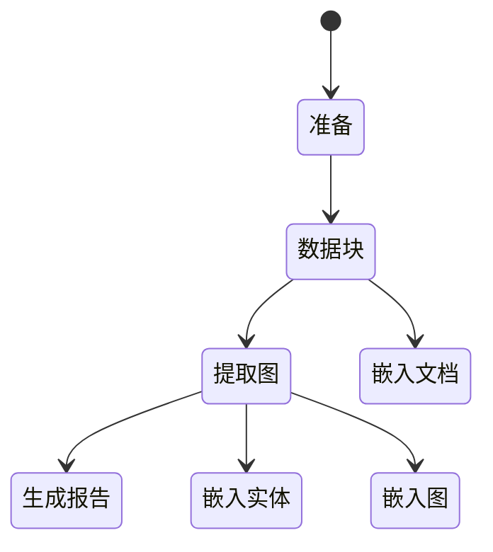

# 索引架构

## 关键概念

### 知识模型

为了支持 GraphRAG 系统，索引引擎的输出（在默认配置模式下）与我们称为 GraphRAG 知识模型的知识模型保持一致。
该模型旨在抽象底层数据存储技术，并为 GraphRAG 系统提供通用的交互接口。
在正常使用情况下，GraphRAG 索引器的输出将被加载到数据库系统中，GraphRAG 的查询引擎将使用知识模型的数据存储类型与数据库交互。

### 工作流

由于数据索引任务的复杂性，我们需要能够将数据管道表示为一系列相互依赖的多个工作流。

### LLM 缓存

GraphRAG 库在设计时就考虑到了 LLM 交互，使用 LLM API 时的一个常见障碍是由于网络延迟、限流等原因导致的各种错误。
由于这些潜在的错误情况，我们在 LLM 交互周围添加了一个缓存层。
当使用相同的输入集（提示和调优参数）发出完成请求时，如果存在缓存结果，我们会返回该结果。
这使得我们的索引器能够更好地应对网络问题，实现幂等性，并提供更高效的最终用户体验。
