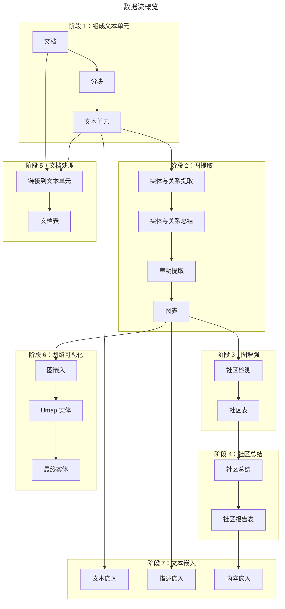
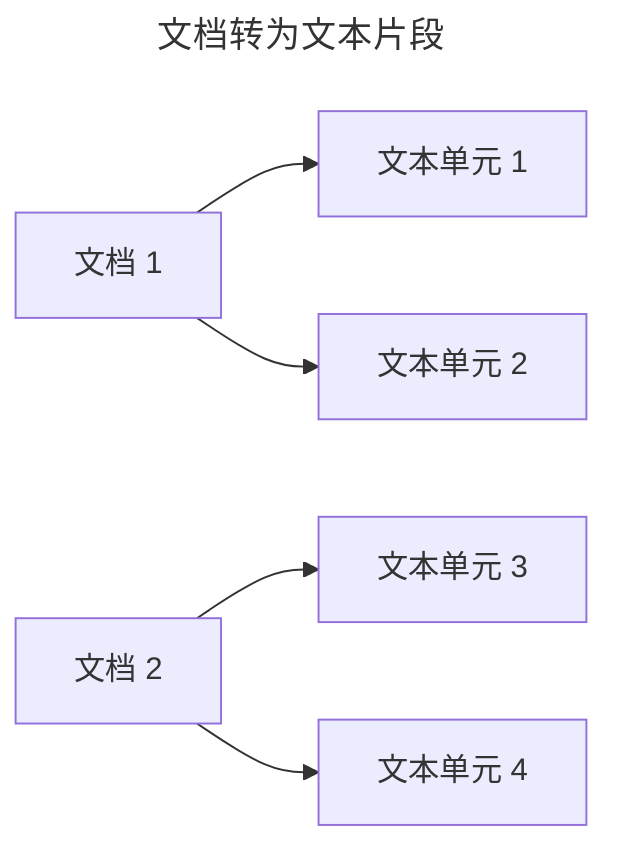
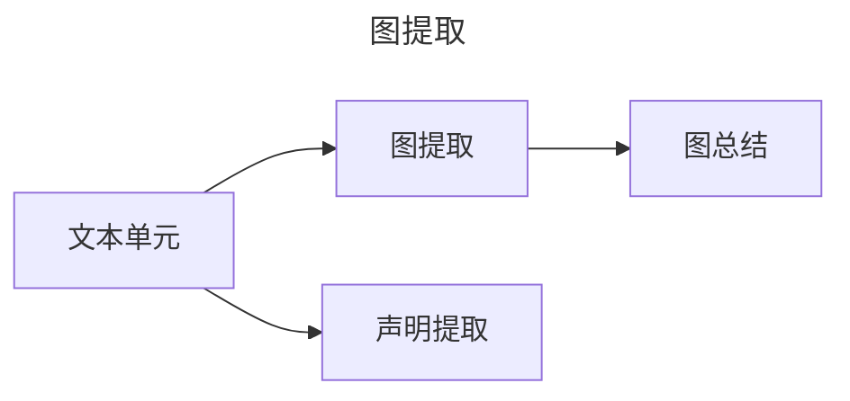
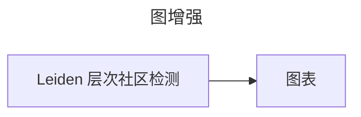
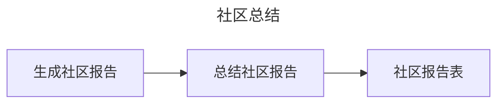
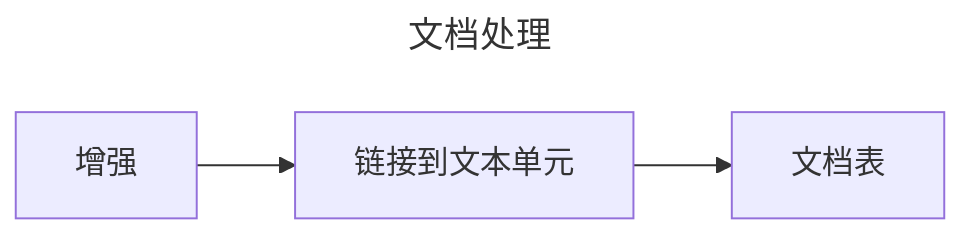
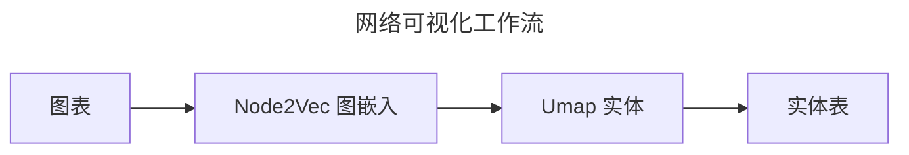
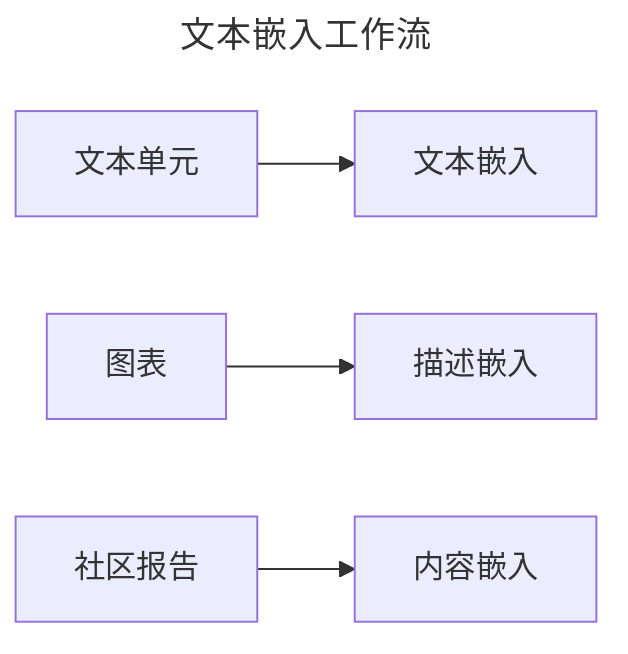

# 索引数据流

## GraphRAG 知识模型

知识模型是为符合我们数据模型定义的数据输出规范。您可以在 GraphRAG 仓库的 `python/graphrag/graphrag/model` 文件夹中找到这些定义。以下是提供的实体类型。以下字段表示默认进行文本嵌入的字段。

- `文档` - 系统输入的文档。这些文档可以表示 CSV 中的单行数据或单个 .txt 文件。
- `文本单元` - 用于分析的文本片段。这些片段的大小、重叠以及是否遵循任何数据边界都可以在下方配置。常见用例是将 `CHUNK_BY_COLUMNS` 设置为 `id`，以便文档和文本单元之间形成一对多的关系，而不是多对多。
- `实体` - 从文本单元中提取的实体。这些实体可以代表人、地点、事件或其他您提供的实体模型。
- `关系` - 两个实体之间的关系。
- `协变量` - 提取的声明信息，包含关于实体的可能具有时间限制的陈述。
- `社区` - 在构建实体和关系图后，我们对其进行层次社区检测，以创建聚类结构。
- `社区报告` - 每个社区的内容被总结为生成的报告，便于人类阅读和下游搜索。

## 默认配置工作流

让我们来看看默认配置工作流如何将文本文档转换为 _GraphRAG 知识模型_。本页提供此过程主要步骤的概览。要完全配置此工作流，请查看 [配置](../config/overview.md) 文档。

## 阶段 1：组成文本单元

默认配置工作流的第一个阶段是将输入文档转换为 _文本单元_。_文本单元_ 是用于图提取技术的文本片段。它们还被提取的知识项用作源引用，以支持从概念追溯到原始源文本的导航和出处。

分块大小（以 token 计数）是用户可配置的。默认设置为 300 个 token，尽管我们使用 1200 个 token 的分块和单一的“提取”步骤取得了积极的经验。（“提取”步骤是后续的提取过程）。较大的分块会导致输出保真度较低且引用文本的意义较小；然而，使用较大分块可以显著加快处理速度。

分组配置也是用户可配置的。默认情况下，我们将分块与文档边界对齐，这意味着文档和文本单元之间存在严格的一对多关系。在极少数情况下，这可以转换为多对多关系。这在文档非常短且需要多个文档组成有意义的分析单元时非常有用（例如推文或聊天记录）。

## 阶段 2：图提取

在此阶段，我们分析每个文本单元并提取图原语：_实体_、_关系_ 和 _声明_。
实体和关系通过我们的 _entity_extract_ 动词同时提取，声明通过 _claim_extract_ 动词提取。结果随后合并并传递到流水线的后续阶段。

### 实体与关系提取

在图提取的第一步中，我们处理每个文本单元，使用 LLM 从原始文本中提取实体和关系。此步骤的输出是每个文本单元的子图，包含一个具有 _标题_、_类型_ 和 _描述_ 的 **实体** 列表，以及一个具有 _源_、_目标_ 和 _描述_ 的 **关系** 列表。

这些子图被合并在一起——任何具有相同 _标题_ 和 _类型_ 的实体通过将其描述合并为一个数组进行合并。类似地，任何具有相同 _源_ 和 _目标_ 的关系通过将其描述合并为一个数组进行合并。

### 实体与关系总结

现在我们有了实体和关系的图，每个都带有一个描述列表，我们可以将这些列表总结为每个实体和关系的单一描述。这是通过要求 LLM 提供一个简短的总结来完成的，该总结捕获每个描述中的所有独特信息。这使得所有实体和关系都能拥有一个简洁的描述。

### 声明提取（可选）

最后，作为独立的工作流，我们从源文本单元中提取声明。这些声明表示具有评估状态和时间限制的积极事实陈述。这些声明作为主要产物导出，称为 **协变量**。

注意：声明提取是 _可选的_，默认关闭。这是因为声明提取通常需要提示调整才能有效。

## 阶段 3：图增强

现在我们有了一个可用的实体和关系图，我们希望了解其社区结构。这些结构为我们提供了理解图拓扑结构的明确方式。

### 社区检测

在此步骤中，我们使用层次 Leiden 算法生成实体社区的层次结构。该方法将对我们的图应用递归社区聚类，直到达到社区大小阈值。这使我们能够理解图的社区结构，并提供一种在不同粒度级别上导航和总结图的方法。

### 图表

一旦图增强步骤完成，最终的 **实体**、**关系** 和 **社区** 表将被导出。

## 阶段 4：社区总结

此时，我们有了一个功能性的实体和关系图以及实体的社区层次结构。

现在我们希望基于社区数据生成每个社区的报告。这使我们能够在多个图粒度级别上获得对图的高级理解。例如，如果社区 A 是顶级社区，我们将获得关于整个图的报告。如果社区是较低级别的，我们将获得关于局部集群的报告。

### 生成社区报告

在此步骤中，我们使用 LLM 为每个社区生成总结。这使我们能够理解每个社区中包含的独特信息，并提供从高层次或低层次视角对图的范围理解。这些报告包含执行概述，并引用社区子结构中的关键实体、关系和声明。

### 总结社区报告

在此步骤中，每个 _社区报告_ 随后通过 LLM 进行总结，以供简短使用。

### 社区报告表

此时，进行一些簿记工作，并导出 **社区报告** 表。

## 阶段 5：文档处理

在此工作流阶段，我们为知识模型创建 _文档_ 表。

### 使用列增强（仅限 CSV）

如果工作流处理的是 CSV 数据，您可以配置工作流以向文档输出添加额外的字段。这些字段应存在于传入的 CSV 表中。有关配置的详细信息，请参阅 [配置文档](../config/overview.md)。

### 链接到文本单元

在此步骤中，我们将每个文档链接到第一阶段创建的文本单元。这使我们能够了解哪些文档与哪些文本单元相关，反之亦然。

### 文档表

此时，我们可以将 **文档** 表导出到知识模型中。

## 阶段 6：网络可视化（可选）

在此工作流阶段，我们执行一些步骤以支持现有图中高维向量空间的网络可视化。此时有两个逻辑图在起作用：_实体-关系_ 图和 _文档_ 图。

### 图嵌入

在此步骤中，我们使用 Node2Vec 算法生成图的向量表示。这使我们能够理解图的隐式结构，并提供一个额外的向量空间，以便在查询阶段搜索相关概念。

### 降维

对于每个逻辑图，我们执行 UMAP 降维以生成图的二维表示。这使我们能够在二维空间中可视化图，并理解图中节点之间的关系。UMAP 嵌入被降维为 x/y 坐标的二维。

## 阶段 7：文本嵌入

对于需要下游向量搜索的所有产物，我们生成文本嵌入作为最后一步。这些嵌入直接写入配置的向量存储。默认情况下，我们嵌入实体描述、文本单元文本和社区报告文本。

