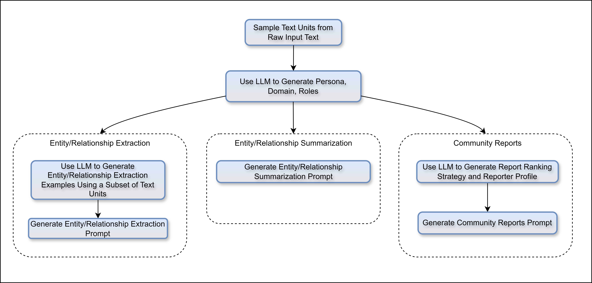

<<<<<<< HEAD
# Auto Prompt Tuning ⚙️

GraphRAG provides the ability to create domain adapted prompts for the generation of the knowledge graph. This step is optional, though it is highly encouraged to run it as it will yield better results when executing an Index Run.

These are generated by loading the inputs, splitting them into chunks (text units) and then running a series of LLM invocations and template substitutions to generate the final prompts. We suggest using the default values provided by the script, but in this page you'll find the detail of each in case you want to further explore and tweak the prompt tuning algorithm.

<p align="center">

</p>
<p align="center">
Figure 1: Auto Tuning Conceptual Diagram.
</p>

## Prerequisites

Before running auto tuning, ensure you have already initialized your workspace with the `graphrag init` command. This will create the necessary configuration files and the default prompts. Refer to the [Init Documentation](../config/init.md) for more information about the initialization process.

## Usage

You can run the main script from the command line with various options:

```bash
graphrag prompt-tune [--root ROOT] [--config CONFIG] [--domain DOMAIN]  [--selection-method METHOD] [--limit LIMIT] [--language LANGUAGE] \
=======
# 自动提示调整 ⚙️

GraphRAG 提供了一种能力，可以为知识图谱的生成创建领域适应的提示。此步骤是可选的，但强烈建议运行此步骤，因为它会在执行索引运行时产生更好的结果。

这些提示通过加载输入数据，将其分割成文本单元（text units），然后运行一系列 LLM 调用和模板替换来生成最终提示。我们建议使用脚本提供的默认值，但在此页面中您将找到每个参数的详细信息，以供您进一步探索和调整提示调整算法。

<p align="center">

</p>
<p align="center">
图1：自动调整概念图。
</p>

## 前提条件

在运行自动调整之前，请确保您已使用 `graphrag init` 命令初始化了工作空间。这将创建必要的配置文件和默认提示。有关初始化过程的更多信息，请参阅 [初始化文档](../config/init.md)。

## 使用方法

您可以通过命令行运行主脚本，并使用各种选项：

```bash
graphrag prompt-tune [--root ROOT] [--config CONFIG] [--domain DOMAIN] [--selection-method METHOD] [--limit LIMIT] [--language LANGUAGE] \
>>>>>>> origin
[--max-tokens MAX_TOKENS] [--chunk-size CHUNK_SIZE] [--n-subset-max N_SUBSET_MAX] [--k K] \
[--min-examples-required MIN_EXAMPLES_REQUIRED] [--discover-entity-types] [--output OUTPUT]
```

<<<<<<< HEAD
## Command-Line Options

- `--config` (required): The path to the configuration file. This is required to load the data and model settings.

- `--root` (optional): The data project root directory, including the config files (YML, JSON, or .env). Defaults to the current directory.

- `--domain` (optional): The domain related to your input data, such as 'space science', 'microbiology', or 'environmental news'. If left empty, the domain will be inferred from the input data.

- `--selection-method` (optional): The method to select documents. Options are all, random, auto or top. Default is random.

- `--limit` (optional): The limit of text units to load when using random or top selection. Default is 15.

- `--language` (optional): The language to use for input processing. If it is different from the inputs' language, the LLM will translate. Default is "" meaning it will be automatically detected from the inputs.

- `--max-tokens` (optional): Maximum token count for prompt generation. Default is 2000.

- `--chunk-size` (optional): The size in tokens to use for generating text units from input documents. Default is 200.

- `--n-subset-max` (optional): The number of text chunks to embed when using auto selection method. Default is 300.

- `--k` (optional): The number of documents to select when using auto selection method. Default is 15.

- `--min-examples-required` (optional): The minimum number of examples required for entity extraction prompts. Default is 2.

- `--discover-entity-types` (optional): Allow the LLM to discover and extract entities automatically. We recommend using this when your data covers a lot of topics or it is highly randomized.

- `--output` (optional): The folder to save the generated prompts. Default is "prompts".

## Example Usage

```bash
python -m graphrag prompt-tune --root /path/to/project --config /path/to/settings.yaml --domain "environmental news" \
--selection-method random --limit 10 --language English --max-tokens 2048 --chunk-size 256 --min-examples-required 3 \
--no-entity-types --output /path/to/output
```

or, with minimal configuration (suggested):
=======
## 命令行选项

- `--config`（必需）：配置文件路径。需要此参数来加载数据和模型设置。

- `--root`（可选）：数据项目根目录，包括配置文件（YML、JSON 或 .env）。默认为当前目录。

- `--domain`（可选）：与输入数据相关的领域，例如“空间科学”、“微生物学”或“环境新闻”。如果留空，将从输入数据中推断领域。

- `--selection-method`（可选）：选择文档的方法。选项包括 all、random、auto 或 top。默认值为 random。

- `--limit`（可选）：使用 random 或 top 选择方法时加载的文本单元限制。默认值为 15。

- `--language`（可选）：用于输入处理的语言。如果与输入数据的语言不同，LLM 将进行翻译。默认值为 ""，表示将从输入数据中自动检测。

- `--max-tokens`（可选）：提示生成的最大令牌数。默认值为 2000。

- `--chunk-size`（可选）：从输入文档生成文本单元的令牌大小。默认值为 200。

- `--n-subset-max`（可选）：使用 auto 选择方法时嵌入的文本块数量。默认值为 300。

- `--k`（可选）：使用 auto 选择方法时选择的文档数量。默认值为 15。

- `--min-examples-required`（可选）：实体提取提示所需的最少示例数。默认值为 2。

- `--discover-entity-types`（可选）：允许 LLM 自动发现和提取实体。建议在数据覆盖多个主题或高度随机化时使用此选项。

- `--output`（可选）：保存生成的提示的文件夹。默认值为 "prompts"。

## 示例用法

```bash
python -m graphrag prompt-tune --root /path/to/project --config /path/to/settings.yaml --domain "环境新闻" \
--selection-method random --limit 10 --language 英语 --max-tokens 2048 --chunk-size 256 --min-examples-required 3 \
--no-entity-types --output /path/to/output
```

或使用最少配置（建议）：
>>>>>>> origin

```bash
python -m graphrag prompt-tune --root /path/to/project --config /path/to/settings.yaml --no-entity-types
```

<<<<<<< HEAD
## Document Selection Methods

The auto tuning feature ingests the input data and then divides it into text units the size of the chunk size parameter.
After that, it uses one of the following selection methods to pick a sample to work with for prompt generation:

- `random`: Select text units randomly. This is the default and recommended option.
- `top`: Select the head n text units.
- `all`: Use all text units for the generation. Use only with small datasets; this option is not usually recommended.
- `auto`: Embed text units in a lower-dimensional space and select the k nearest neighbors to the centroid. This is useful when you have a large dataset and want to select a representative sample.

## Modify Env Vars

After running auto tuning, you should modify the following environment variables (or config variables) to pick up the new prompts on your index run. Note: Please make sure to update the correct path to the generated prompts, in this example we are using the default "prompts" path.
=======
## 文档选择方法

自动调整功能会摄取输入数据，然后将其分成与 chunk size 参数大小相同的文本单元。之后，它使用以下选择方法之一来挑选用于提示生成的样本：

- `random`：随机选择文本单元。这是默认且推荐的选项。
- `top`：选择前 n 个文本单元。
- `all`：使用所有文本单元进行生成。仅适用于小型数据集，通常不推荐此选项。
- `auto`：将文本单元嵌入到较低维空间，并选择距质心最近的 k 个邻居。适用于大型数据集且希望选择代表性样本时。

## 修改环境变量

运行自动调整后，您应修改以下环境变量（或配置文件变量）以在索引运行时使用新生成的提示。请确保更新生成的提示的正确路径，在此示例中我们使用默认的 "prompts" 路径。
>>>>>>> origin

- `GRAPHRAG_ENTITY_EXTRACTION_PROMPT_FILE` = "prompts/entity_extraction.txt"

- `GRAPHRAG_COMMUNITY_REPORT_PROMPT_FILE` = "prompts/community_report.txt"

- `GRAPHRAG_SUMMARIZE_DESCRIPTIONS_PROMPT_FILE` = "prompts/summarize_descriptions.txt"

<<<<<<< HEAD
or in your yaml config file:
=======
或在您的 YAML 配置文件中：
>>>>>>> origin

```yaml
entity_extraction:
  prompt: "prompts/entity_extraction.txt"

summarize_descriptions:
  prompt: "prompts/summarize_descriptions.txt"

community_reports:
  prompt: "prompts/community_report.txt"
<<<<<<< HEAD
```
=======
```
>>>>>>> origin
