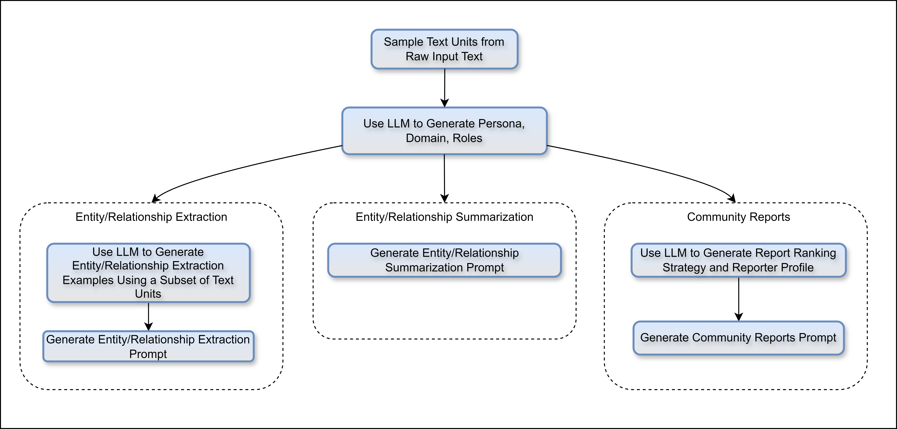

# 自动提示调整 ⚙️

GraphRAG 提供了一种能力，可以为知识图谱的生成创建领域适应的提示。此步骤是可选的，但强烈建议运行此步骤，因为它会在执行索引运行时产生更好的结果。

这些提示通过加载输入数据，将其分割成文本单元（text units），然后运行一系列 LLM 调用和模板替换来生成最终提示。我们建议使用脚本提供的默认值，但在此页面中您将找到每个参数的详细信息，以供您进一步探索和调整提示调整算法。

<p align="center">

</p>
<p align="center">
图1：自动调整概念图。
</p>

## 前提条件

在运行自动调整之前，请确保您已使用 `graphrag init` 命令初始化了工作空间。这将创建必要的配置文件和默认提示。有关初始化过程的更多信息，请参阅 [初始化文档](../config/init.md)。

## 使用方法

您可以通过命令行运行主脚本，并使用各种选项：

```bash
graphrag prompt-tune [--root ROOT] [--domain DOMAIN]  [--selection-method METHOD] [--limit LIMIT] [--language LANGUAGE] \
[--max-tokens MAX_TOKENS] [--chunk-size CHUNK_SIZE] [--n-subset-max N_SUBSET_MAX] [--k K] \
[--min-examples-required MIN_EXAMPLES_REQUIRED] [--discover-entity-types] [--output OUTPUT]
```

## 命令行选项

- `--root` (optional): Path to the project directory that contains the config file (settings.yaml). Defaults to the current directory.

- `--domain`（可选）：与输入数据相关的领域，例如“空间科学”、“微生物学”或“环境新闻”。如果留空，将从输入数据中推断领域。

- `--selection-method`（可选）：选择文档的方法。选项包括 all、random、auto 或 top。默认值为 random。

- `--limit`（可选）：使用 random 或 top 选择方法时加载的文本单元限制。默认值为 15。

- `--language`（可选）：用于输入处理的语言。如果与输入数据的语言不同，LLM 将进行翻译。默认值为 ""，表示将从输入数据中自动检测。

- `--max-tokens`（可选）：提示生成的最大令牌数。默认值为 2000。

- `--chunk-size`（可选）：从输入文档生成文本单元的令牌大小。默认值为 200。

- `--n-subset-max`（可选）：使用 auto 选择方法时嵌入的文本块数量。默认值为 300。

- `--k`（可选）：使用 auto 选择方法时选择的文档数量。默认值为 15。

- `--min-examples-required`（可选）：实体提取提示所需的最少示例数。默认值为 2。

- `--discover-entity-types`（可选）：允许 LLM 自动发现和提取实体。建议在数据覆盖多个主题或高度随机化时使用此选项。

- `--output`（可选）：保存生成的提示的文件夹。默认值为 "prompts"。

## 示例用法

```bash
python -m graphrag prompt-tune --root /path/to/project --domain "environmental news" \
--selection-method random --limit 10 --language English --max-tokens 2048 --chunk-size 256 --min-examples-required 3 \
--no-discover-entity-types --output /path/to/output
```

或使用最少配置（建议）：

```bash
python -m graphrag prompt-tune --root /path/to/project --no-discover-entity-types
```

## 文档选择方法

自动调整功能会摄取输入数据，然后将其分成与 chunk size 参数大小相同的文本单元。之后，它使用以下选择方法之一来挑选用于提示生成的样本：

- `random`: Select text units randomly. This is the default and recommended option.
- `top`: Select the head _n_ text units.
- `all`: Use all text units for the generation. Use only with small datasets; this option is not usually recommended.
- `auto`: Embed text units in a lower-dimensional space and select the _k_ nearest neighbors to the centroid. This is useful when you have a large dataset and want to select a representative sample.

## Modify Config

After running auto tuning, you should modify the following config variables to pick up the new prompts on your index run. Note: Please make sure to update the correct path to the generated prompts, in this example we are using the default "prompts" path.

```yaml
extract_graph:
  prompt: "prompts/extract_graph.txt"

summarize_descriptions:
  prompt: "prompts/summarize_descriptions.txt"

community_reports:
  prompt: "prompts/community_report.txt"
```
