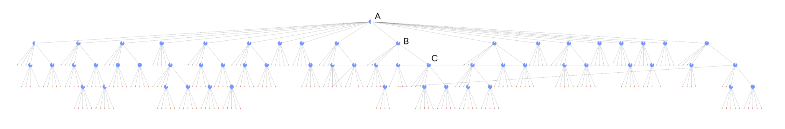

# DRIFT 搜索 🔎

## 结合本地和全局搜索

GraphRAG 是一种利用大型语言模型（LLMs）从非结构化文本文档中创建知识图谱和摘要，并利用这些知识图谱和摘要来改进对私有数据集的检索增强生成（RAG）操作的技术。它能够在大型私有非结构化文本文档库中提供全面的全局概览，同时支持对详细的本地化信息的探索。通过使用 LLMs 创建连接和描述文档中包含的实体和关系的全面知识图谱，GraphRAG 利用数据的语义结构来生成对各种复杂用户查询的响应。

DRIFT 搜索（动态推理与灵活遍历搜索，Dynamic Reasoning and Inference with Flexible Traversal）基于微软的 GraphRAG 技术，结合了全局搜索和本地搜索的特性，通过我们的 [DRIFT 搜索](https://github.com/microsoft/graphrag/blob/main//graphrag/query/structured_search/drift_search/) 方法生成详细的响应，以在计算成本和结果质量之间取得平衡。

## 方法论

<i><small>
图 1. 完整的 DRIFT 搜索层次结构，突出显示 DRIFT 搜索过程的三个核心阶段。A（初步阶段）：DRIFT 将用户查询与前 K 个语义相关性最高的社区报告进行比较，生成广泛的初步答案和后续问题，以引导进一步探索。B（后续阶段）：DRIFT 使用本地搜索来优化查询，生成额外的中间答案和后续问题以提高具体性，引导搜索引擎获取更具上下文信息的内容。图中每个节点上的标志显示了算法继续进行查询扩展步骤的置信度。C（输出层次结构）：最终输出是一个按相关性排序的问题和答案层次结构，反映了全局洞察和本地优化的平衡组合，使结果具有适应性和全面性。</small></i>

DRIFT 搜索通过在搜索过程中加入社区信息，为本地搜索查询引入了一种新方法。这极大地扩展了查询起点的广度，并导致在最终答案中检索和使用更多样化的事实。这种扩展增强了 GraphRAG 查询引擎，为本地搜索提供了更全面的选择，利用社区洞察将查询细化为详细的后续问题。

## 配置

以下是 [DRIFTSearch 类](https://github.com/microsoft/graphrag/blob/main//graphrag/query/structured_search/drift_search/search.py) 的关键参数：

- `llm`：用于响应生成的大型语言模型对象
- `context_builder`：用于从社区报告和查询信息准备上下文数据的 [上下文构建器](https://github.com/microsoft/graphrag/blob/main/graphrag/query/structured_search/drift_search/drift_context.py) 对象
- `config`：用于定义 DRIFT 搜索超参数的模型。[DRIFT 配置模型](https://github.com/microsoft/graphrag/blob/main/graphrag/config/models/drift_search_config.py)
- `token_encoder`：用于跟踪算法预算的令牌编码器
- `query_state`：在 [查询状态](https://github.com/microsoft/graphrag/blob/main/graphrag/query/structured_search/drift_search/state.py) 中定义的状态对象，用于跟踪 DRIFT 搜索实例的执行情况，以及后续操作和 [DRIFT 动作](https://github.com/microsoft/graphrag/blob/main/graphrag/query/structured_search/drift_search/action.py)。

## 如何使用

DRIFT 搜索场景的示例可在以下 [笔记本](../examples_notebooks/drift_search.ipynb) 中找到。

## 了解更多

有关 DRIFT 搜索方法的更深入了解，请参阅我们的 [DRIFT 搜索博客文章](https://www.microsoft.com/en-us/research/blog/introducing-drift-search-combining-global-and-local-search-methods-to-improve-quality-and-efficiency/)。