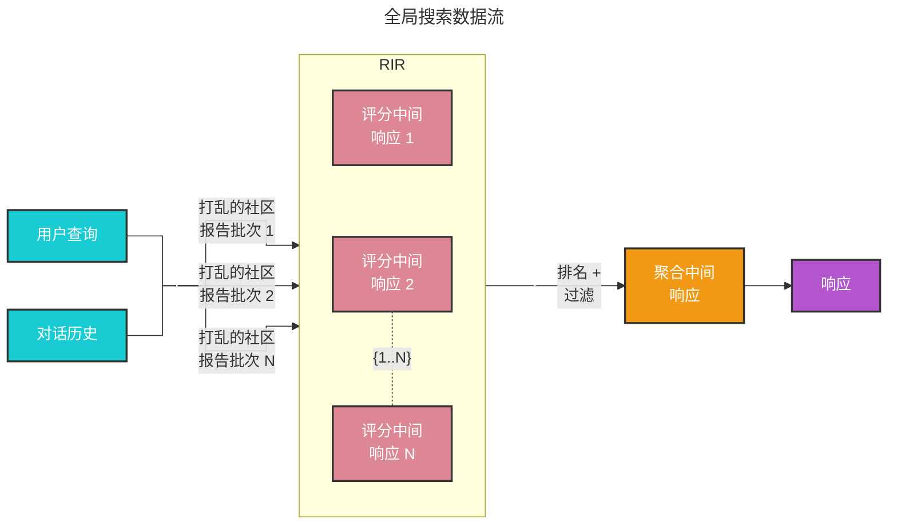

# 全局搜索 🔎

## 整体数据集推理

基础 RAG 在处理需要跨数据集聚合信息以构建答案的查询时表现不佳。例如，“数据中的前 5 个主题是什么？”这样的查询表现得很差，因为基础 RAG 依赖于对数据集内语义相似文本内容的向量搜索。查询中没有任何内容可以引导它找到正确的信息。

然而，通过 GraphRAG，我们可以回答此类问题，因为 LLM 生成的知识图谱结构揭示了数据集的整体结构（以及主题）。这允许将私有数据集组织成有意义的语义集群，并进行预总结。使用我们的 [全局搜索](https://github.com/microsoft/graphrag/blob/main//graphrag/query/structured_search/global_search/) 方法，LLM 利用这些集群来总结这些主题以响应用户查询。

## 方法论

给定用户查询和（可选的）对话历史，全局搜索方法使用从图的社区层级指定层级收集的 LLM 生成的社区报告作为上下文数据，以 map-reduce 方式生成响应。在 `map` 阶段，社区报告被分割成预定义大小的文本块。每个文本块随后用于生成中间响应，包含一个点列表，每个点附带一个数字评分，指示该点的重要性。在 `reduce` 阶段，从中间响应中过滤出最重要的点集进行聚合，并用作生成最终响应的上下文。

全局搜索响应的质量可能受到用于获取社区报告的社区层级选择的影响。较低层级的社区报告较为详细，往往能生成更全面的响应，但由于报告数量较多，可能增加生成最终响应所需的时间和 LLM 资源。

## 配置

以下是 [GlobalSearch 类](https://github.com/microsoft/graphrag/blob/main//graphrag/query/structured_search/global_search/search.py) 的关键参数：

* `llm`：用于响应生成的大语言模型对象
* `context_builder`：用于从社区报告准备上下文数据的 [上下文构建器](https://github.com/microsoft/graphrag/blob/main//graphrag/query/structured_search/global_search/community_context.py) 对象
* `map_system_prompt`：`map` 阶段使用的提示模板，默认模板可在 [map_system_prompt](https://github.com/microsoft/graphrag/blob/main//graphrag/prompts/query/global_search_map_system_prompt.py) 找到
* `reduce_system_prompt`：`reduce` 阶段使用的提示模板，默认模板可在 [reduce_system_prompt](https://github.com/microsoft/graphrag/blob/main//graphrag/prompts/query/global_search_reduce_system_prompt.py) 找到
* `response_type`：描述所需响应类型和格式的自由文本（例如，`多段落`、`多页报告`）
* `allow_general_knowledge`：设置为 True 时，会在 `reduce_system_prompt` 中添加额外指令，提示 LLM 融入数据集之外的相关现实世界知识。请注意，这可能会增加幻觉，但在某些场景下可能有用。默认值为 False
* `general_knowledge_inclusion_prompt`：如果启用 `allow_general_knowledge`，则添加到 `reduce_system_prompt` 的指令。默认指令可在 [general_knowledge_instruction](https://github.com/microsoft/graphrag/blob/main//graphrag/prompts/query/global_search_knowledge_system_prompt.py) 找到
* `max_data_tokens`：上下文数据的令牌预算
* `map_llm_params`：传递给 `map` 阶段 LLM 调用的额外参数字典（例如，温度、最大令牌数）
* `reduce_llm_params`：传递给 `reduce` 阶段 LLM 调用的额外参数字典（例如，温度、最大令牌数）
* `context_builder_params`：在 `map` 阶段构建上下文窗口时传递给 [`context_builder`](https://github.com/microsoft/graphrag/blob/main//graphrag/query/structured_search/global_search/community_context.py) 对象的额外参数字典
* `concurrent_coroutines`：控制 `map` 阶段的并行度
* `callbacks`：可选的回调函数，可用于为 LLM 的完成流事件提供自定义事件处理程序

## 使用方法

全局搜索场景的示例可在以下 [笔记本](../examples_notebooks/global_search.ipynb) 中找到。