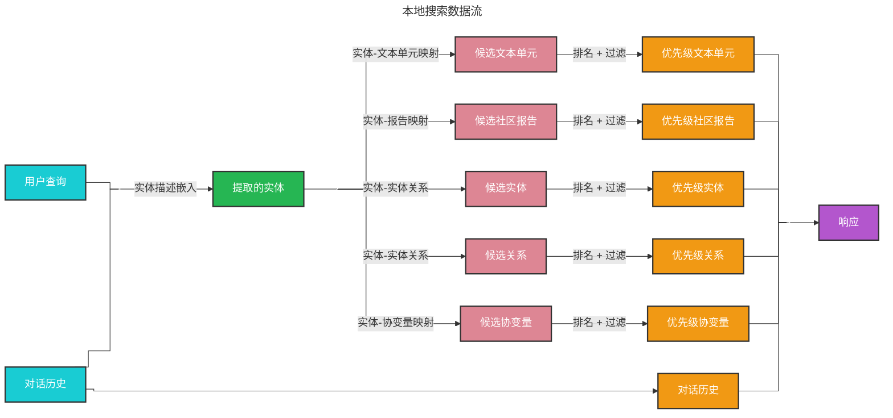

# 本地搜索 🔎

## 基于实体的推理

[本地搜索](https://github.com/microsoft/graphrag/blob/main//graphrag/query/structured_search/local_search/) 方法结合了知识图谱中的结构化数据和输入文档中的非结构化数据，在查询时通过与用户输入语义相关的实体信息增强大语言模型（LLM）的上下文。它非常适合回答需要理解输入文档中提到的特定实体的问题（例如，“洋甘菊的治疗特性是什么？”）。

## 方法论

给定用户查询和（可选的）对话历史，本地搜索方法从知识图谱中识别出一组与用户输入语义相关的实体。这些实体作为知识图谱的访问点，能够提取更多相关细节，例如关联实体、关系、实体协变量和社区报告。此外，它还会从与识别实体相关的原始输入文档中提取相关的文本块。这些候选数据源随后会被优先级排序和过滤，以适应预定义大小的单一上下文窗口，用于生成对用户查询的响应。

## 配置

以下是 [LocalSearch 类](https://github.com/microsoft/graphrag/blob/main//graphrag/query/structured_search/local_search/search.py) 的关键参数：

* `llm`：用于响应生成的大语言模型对象
* `context_builder`：用于从知识模型对象集合中准备上下文数据的 [上下文构建器](https://github.com/microsoft/graphrag/blob/main//graphrag/query/structured_search/local_search/mixed_context.py) 对象
* `system_prompt`：用于生成搜索响应的提示模板。默认模板可在 [system_prompt](https://github.com/microsoft/graphrag/blob/main//graphrag/prompts/query/local_search_system_prompt.py) 找到
* `response_type`：描述所需响应类型和格式的自由文本（例如，“多段落”、“多页报告”）
* `llm_params`：传递给大语言模型调用的附加参数字典（例如，温度、最大令牌数）
* `context_builder_params`：在构建搜索提示的上下文时传递给 [`context_builder`](https://github.com/microsoft/graphrag/blob/main//graphrag/query/structured_search/local_search/mixed_context.py) 对象的附加参数字典
* `callbacks`：可选的回调函数，可用于为大语言模型的完成流事件提供自定义事件处理程序

## 如何使用

本地搜索场景的示例可在以下 [笔记本](../examples_notebooks/local_search.ipynb) 中找到。