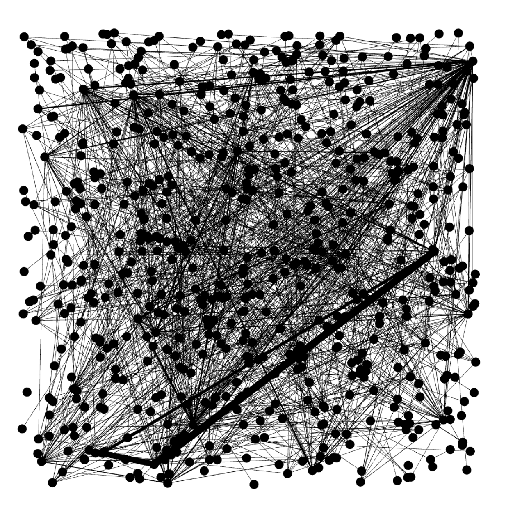
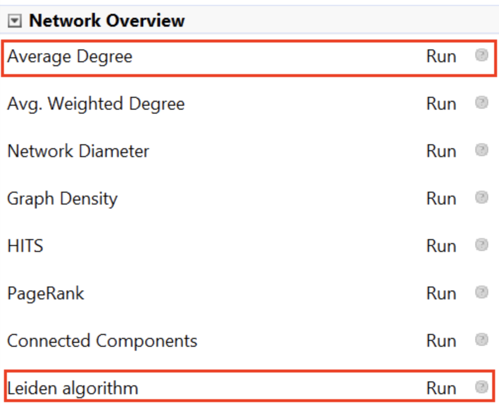
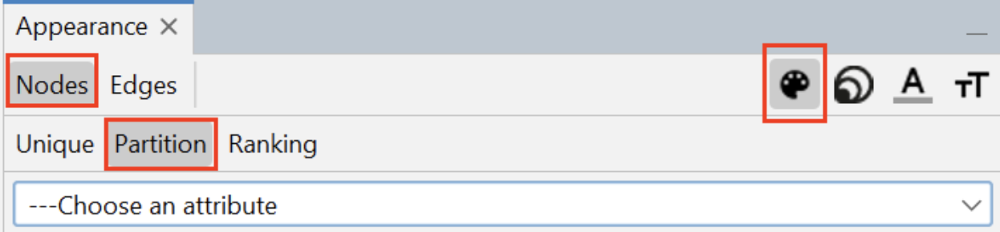
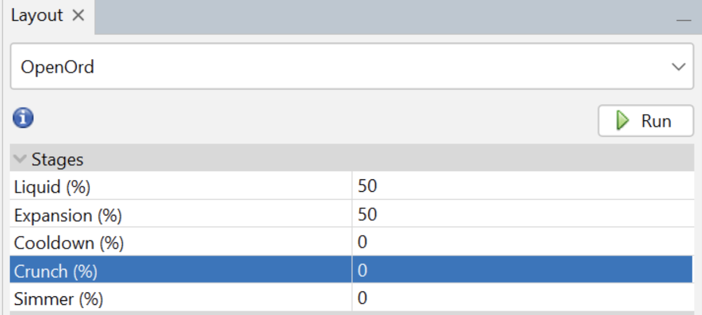
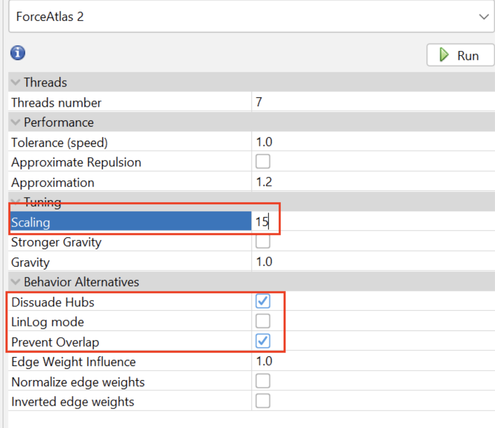

# 可视化和调试您的知识图谱

以下分步指南介绍了在 graphrag 构建知识图谱后进行可视化的过程。请注意，以下推荐的一些设置基于我们自己的经验，效果较好。欢迎更改和探索其他设置，以获得更好的可视化体验！

## 1. 运行管道
在构建索引之前，请检查您的 `settings.yaml` 配置文件，确保已启用 graphml 快照。
```yaml
snapshots:
  graphml: true
```
（可选）为了支持其他可视化工具和探索，可以启用额外的参数以提供对向量嵌入的访问。
```yaml
embed_graph:
  enabled: true # 将为节点生成 node2vec 嵌入
umap:
  enabled: true # 将为节点生成 UMAP 嵌入，为实体表提供可绘制的 x/y 位置
```
在对数据运行索引管道后，将生成一个输出文件夹（由 `storage.base_dir` 设置定义）。

- **输出文件夹**：包含 LLM 索引过程中生成的产物。

## 2. 定位知识图谱
在输出文件夹中，查找名为 `graph.graphml` 的文件。graphml 是一种标准 [文件格式](http://graphml.graphdrawing.org)，许多可视化工具都支持。我们推荐使用 [Gephi](https://gephi.org)。

## 3. 在 Gephi 中打开图谱
1. 安装并打开 Gephi。
2. 导航到包含各种 parquet 文件的 `output` 文件夹。
3. 将 `graph.graphml` 文件导入 Gephi。这将生成一个无向图节点和边的基本视图。

<p align="center">
   
</p>

## 4. 安装 Leiden 算法插件
1. 转到 `工具` -> `插件`。
2. 搜索 "Leiden Algorithm"。
3. 点击 `安装` 并重启 Gephi。

## 5. 运行统计
1. 在右侧的 `统计` 选项卡中，点击 `运行` 以计算 `平均度数` 和 `Leiden 算法`。

<p align="center">
   
</p>

2. 对于 Leiden 算法，调整以下设置：
   - **质量函数**：模块化
   - **分辨率**：1

## 6. 按集群为图谱着色
1. 转到 Gephi 左上方的 `外观` 面板。

<p align="center">
   
</p>

2. 选择 `节点`，然后选择 `分区`，点击右上方的调色板图标。
3. 从下拉菜单中选择 `集群`。
4. 点击 `调色板...` 超链接，然后点击 `生成...`。
5. 取消勾选 `限制颜色数量`，点击 `生成`，然后点击 `确定`。
6. 点击 `应用` 为图谱着色。这将根据 Leiden 算法发现的分区为图谱着色。

## 7. 按度中心性调整节点大小
1. 在左上方的 `外观` 面板中，选择 `节点` -> `排名`。
2. 选择右上方的 `大小` 图标。
3. 选择 `度数` 并设置：
   - **最小值**：10
   - **最大值**：150
4. 点击 `应用`。

## 8. 布局图谱
1. 在左下方的 `布局` 选项卡中，选择 `OpenORD`。

<p align="center">
   
</p>

2. 将 `Liquid` 和 `Expansion` 阶段设置为 50，其他设置为 0。
3. 点击 `运行` 并监控进度。

## 9. 运行 ForceAtlas2
1. 在布局选项中选择 `Force Atlas 2`。

<p align="center">
   
</p>

2. 调整以下设置：
   - **缩放**：15
   - **抑制中心节点**：勾选
   - **LinLog 模式**：取消勾选
   - **防止重叠**：勾选
3. 点击 `运行` 并等待。
4. 当图谱节点看起来稳定且不再显著改变位置时，点击 `停止`。

## 10. 添加文本标签（可选）
1. 在适当的区域开启文本标签。
2. 根据需要配置和调整标签大小。

您的最终图谱现在应该已经完成视觉组织，准备好进行分析！