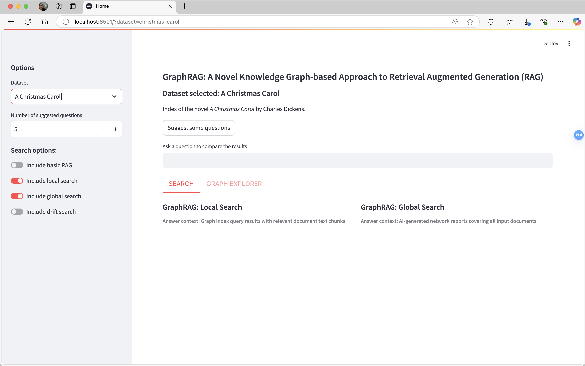
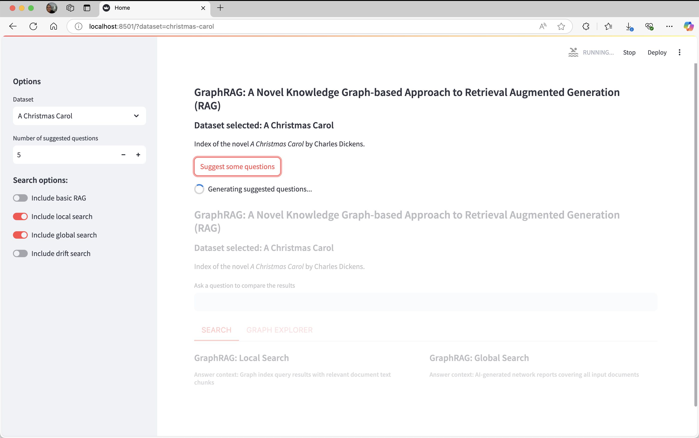
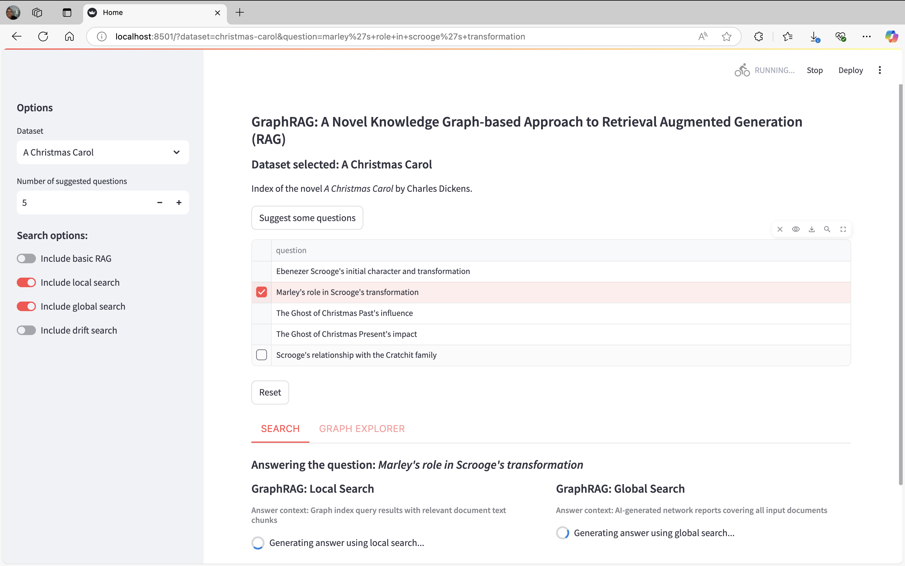
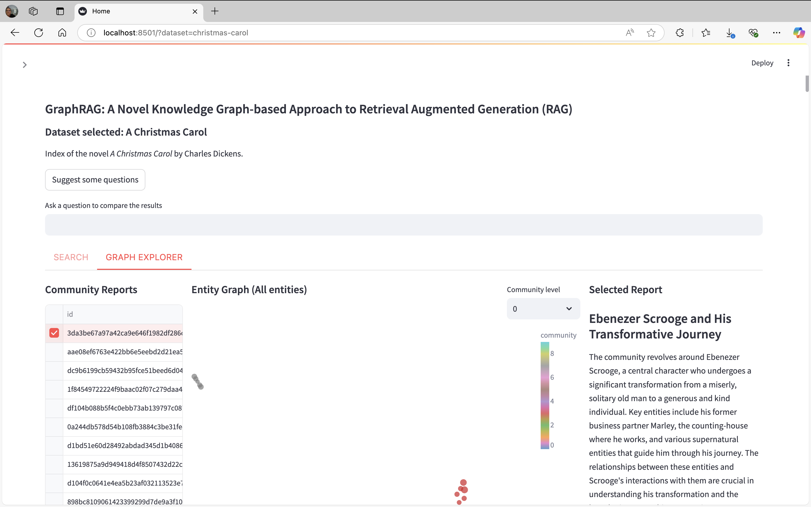

# 统一搜索
GraphRAG搜索比较的统一演示。

⚠️ 此应用程序仅用于演示/实验目的，不受支持。在GraphRAG仓库中提交问题可能不会得到处理。

## 要求：
- Python 3.11
- Poetry
    
此示例应用程序未发布到PyPI，因此您需要克隆GraphRAG仓库并在此文件夹中运行。

我们建议始终使用虚拟环境：

- `python -m venv ./venv`
- `source ./venv/bin/activate`

## 运行索引
在使用统一搜索之前，使用GraphRAG对数据集进行索引。我们建议从[入门指南](https://microsoft.github.io/graphrag/get_started/)开始。您需要启用图嵌入UMAP功能来运行GraphRAG索引以使用统一搜索的功能。
``` yaml
embed_graph:
  enabled: true

umap:
  enabled: true
```

## 数据集
统一搜索通过使用目录列表文件支持多个GraphRAG索引。在存储所有数据集的根文件夹（本地或blob存储）中创建`listing.json`文件，格式如下（每个数据集一个条目）：

```json
[{
    "key": "<数据集1的标识键>",
    "path": "<数据集1的路径>",
    "name": "<数据集1的名称>",
    "description": "<数据集1的描述>",
    "community_level": "<要过滤的社区级别的整数>"
},{
    "key": "<数据集2的标识键>",
    "path": "<数据集2的路径>",
    "name": "<数据集2的名称>",
    "description": "<数据集2的描述>",
    "community_level": "<要过滤的社区级别的整数>"
}]
```

例如，如果您有一个名为“projects”的GraphRAG索引文件夹，并且在其中运行了入门指南的说明，projects文件夹中的`listing.json`可能如下所示：
```json
[{
    "key": "ragtest-demo",
    "path": "ragtest",
    "name": "圣诞颂歌",
    "description": "小说《圣诞颂歌》的入门索引",
    "community_level": 2
}]
```

### 数据源配置
projects文件夹的预期格式如下：
- projects_folder
    - listing.json
    - dataset_1
        - settings.yaml
        - .env（可选，如果您在其他地方声明了环境变量）
        - output
        - prompts
    - dataset_2
        - settings.yaml
        - .env（可选，如果您在其他地方声明了环境变量）
        - output
        - prompts
    - ...

注意：每个数据集文件夹中的其他文件夹将被忽略，但不会影响应用程序。此外，仅`listing.json`中声明的数据集将用于统一搜索。

## 存储数据集
您可以在本地或blob存储中托管统一搜索数据集。

### 1. 本地数据文件夹
1. 创建一个本地文件夹，包含上述所有数据和配置
2. 使用以下环境变量通过绝对路径告知应用程序您的文件夹位置：
- `DATA_ROOT` = `<数据文件夹绝对路径>`

### 2. Azure Blob存储
1. 如果您想使用Azure Blob存储，请创建一个带有“data”容器的blob存储账户，并上传上述所有数据和配置
2. 运行`az login`并选择对该存储具有读取权限的账户
3. 您需要通过以下环境变量告知应用程序使用哪个blob账户：
- `BLOB_ACCOUNT_NAME` = `<blob存储名称>`
4. （可选）在您的blob账户中，您需要创建一个容器来存储您的项目。我们默认使用`data`作为容器名称，如步骤一所述，但如果您想使用其他名称，可以设置：
- `BLOB_CONTAINER_NAME` = `<包含项目的blob容器>`

# 运行应用程序

安装所有依赖项：`poetry install`

使用Streamlit运行项目：`poetry run poe start`

# 如何使用



## 配置面板（左侧面板）
运行应用程序时，您将看到两个主要面板。左侧面板提供应用程序的多个配置选项，此面板可以关闭：
1. **数据集**：此处显示`listing.json`文件中定义的所有数据集，按顺序显示在下拉菜单中。
2. **建议问题数量**：此选项允许用户选择生成多少建议问题。
3. **搜索选项**：此部分允许选择在应用程序中使用的搜索方式。至少需要启用一种搜索方式才能使用应用程序。

## 搜索面板（右侧面板）
在右侧面板中有多个功能：
1. 顶部显示所选数据集的常规信息（名称和描述）。
2. 在数据集信息下方有一个标有“建议一些问题”的按钮，该按钮使用全局搜索分析数据集并生成最重要的几个问题（生成的问题数量为配置面板中设置的数量）。如果您想选择生成的问题，需要单击问题左侧的复选框进行选择。
3. 一个标有“提出问题以比较结果”的文本框，您可以在其中输入要发送的问题。
4. 两个标签页，分别名为“搜索”和“图探索”：
    1. 搜索：此处显示所有搜索结果及其引用。
    2. 图探索：此标签页分为三个部分：社区报告、实体图和选定报告。

##### 建议一些问题点击后


##### 选择问题点击后


##### 图探索标签页
